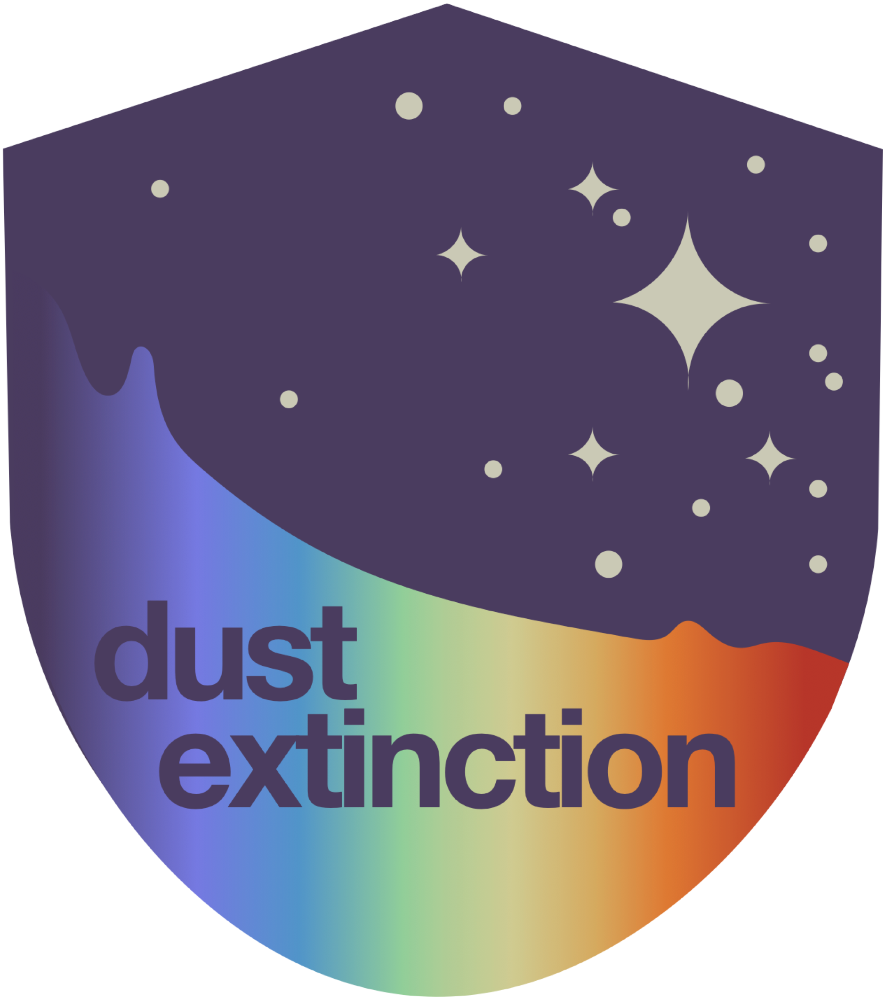

####
Logo
####

The logo was a collaboration between Christina Lindberg, Sarv Parteek Singh, and Karl Gordon.
It uses python code for the extincion curve and AI for ideas (e.g., shield outline), with 
the final logo human created.

Details
=======

Extinction curve is for MW R(V) = 3.1 (G23, Gordon et al. 2023) and is log in the UV and 
linear in the MIR - so 2175 A and 10 and 20 micron silicate features can be seen.  
Code provided in the repository in the docs directory.

Fewer stars are seen in the UV than in the MIR - symbolic of the higher extinction in the UV.

Shield evokes how dust shields us from photons (a nice positive way view).

Different Resolutions
=====================

Small
-----

Medium
------

Full
----

